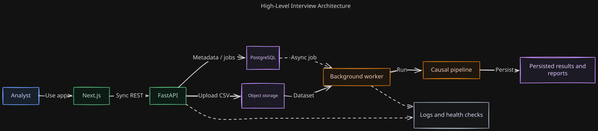
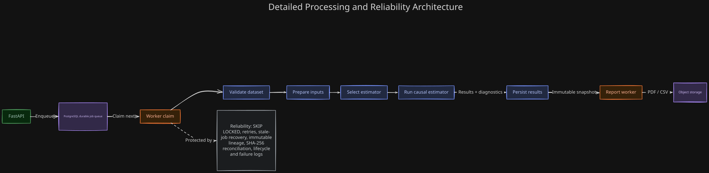
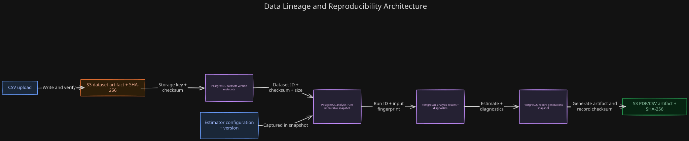
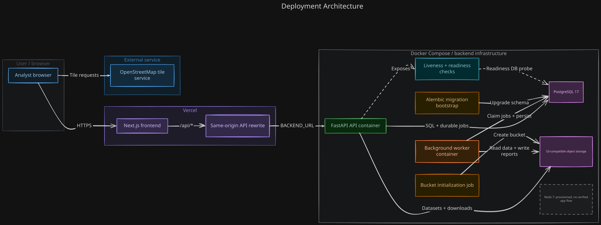
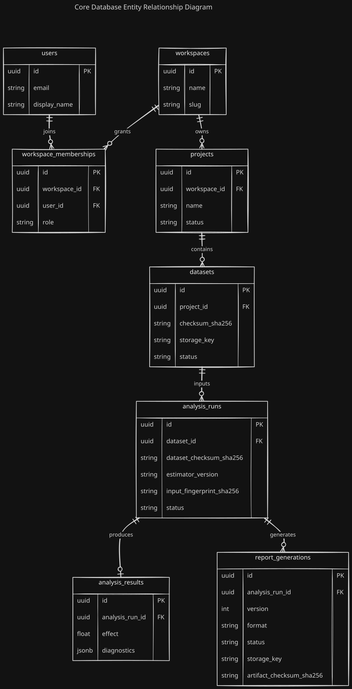

# Incrementality & Lift Measurement Suite

A production-style causal measurement platform for estimating the
incremental impact of marketing campaigns and product interventions.

## Core methods

- Difference-in-differences
- Synthetic control
- Geo holdouts
- Marketing mix modeling
- Off-policy evaluation

## Architecture

- Next.js and TypeScript frontend
- Python and FastAPI backend
- PostgreSQL source of truth
- Redis cache and rate limiting
- S3 or MinIO object storage
- Durable background workers
- Transactional outbox
- TDD and clean architecture

## Architecture

Editable Mermaid sources are stored alongside the SVG diagrams in `docs/architecture/`.

#### 1. High-level architecture

*Demonstrates clear system decomposition and the synchronous request and asynchronous analysis flow.*

#### 2. Processing and reliability

*Demonstrates durable job orchestration, causal-processing stages, and production reliability controls.*

#### 3. Data lineage and reproducibility

*Demonstrates traceable lineage from dataset checksums and immutable snapshots to reproducible report artifacts.*

#### 4. Deployment architecture

*Demonstrates deployment boundaries, infrastructure dependencies, bootstrap jobs, and operational health checks.*

#### 5. Core database entity relationships

*Demonstrates workspace tenancy and relational lineage from projects and datasets through analysis runs to results and reports.*
